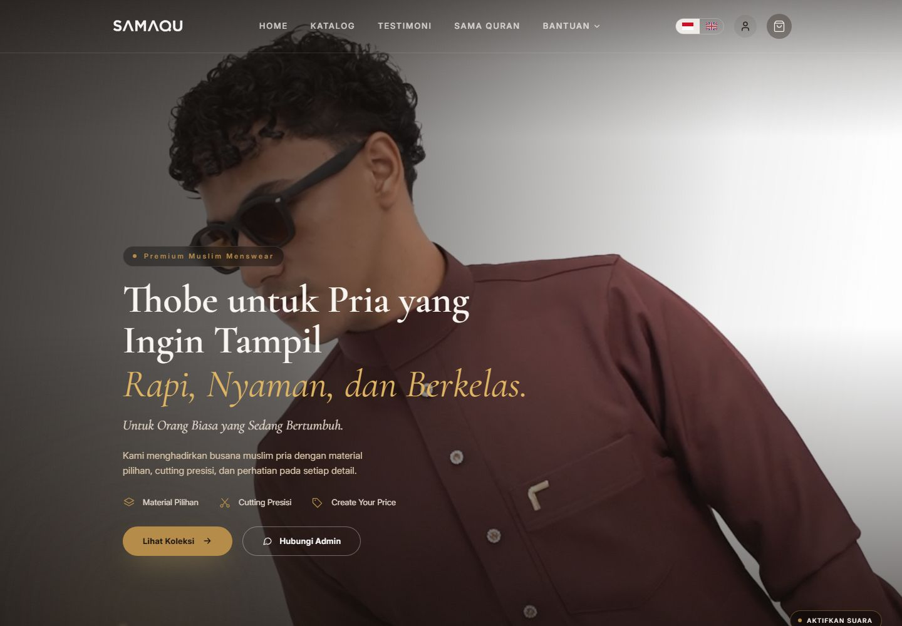
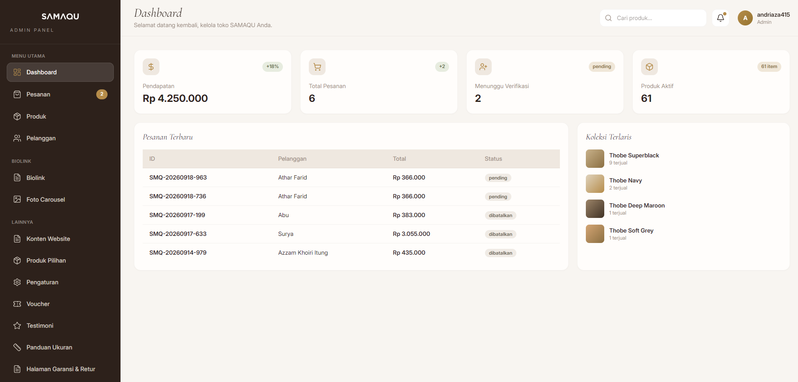

<div align="center">

# Surya — Full-Stack Software Engineer

**Software yang dipakai tiap hari, bukan demo yang cuma bagus di screenshot.**

E-commerce · POS & inventory · Rental & booking · Dashboard data · Integrasi API kurir

[](https://surya32.vercel.app/)
[](https://nextjs.org/)
[](https://react.dev/)
[](https://tailwindcss.com/)
[](https://vercel.com/)
[](#menjalankan-di-lokal)

</div>

---

## Cara saya sampai ke software

Sepuluh tahun saya menjalankan bisnis e-commerce sendiri — tim sampai 30 orang, 1.000 pesanan per hari, omzet stabil Rp150–200 juta per bulan. Dari sana satu hal jadi jelas: software yang berguna bukan yang fiturnya paling banyak, tapi yang **menghapus pekerjaan manual di alur yang paling sering dipakai**.

Hari ini saya membangun sistem seperti itu untuk orang lain: katalog yang tidak bisa selesai dengan daftar produk biasa, checkout tanpa payment gateway, stok yang tidak boleh minus, ongkir dari dua penyedia berbeda, dan laporan yang harus benar-benar cocok dengan uang di rekening.

<sub>**In English:** a portfolio of production systems — e-commerce, POS, rental booking, and data dashboards — with long-form case studies covering business context, architecture decisions, and what happened after release.</sub>

## Isi repo ini

Repo ini adalah sumber dari **[surya32.vercel.app](https://surya32.vercel.app/)**. Dua bagian utamanya:

**Halaman utama** menampilkan tujuh sistem yang sudah dibangun, pengalaman kerja, dan integrasi API yang dipakai di production — lengkap dengan angka, bukan cuma nama teknologi. **[`/cv`](https://surya32.vercel.app/cv)** menyediakan CV satu halaman yang bisa langsung di-print jadi PDF.

**Empat case study** menuliskan project secara utuh: masalah bisnisnya apa, keputusan teknisnya kenapa diambil, dan apa konsekuensinya setelah rilis. Bukan daftar fitur — karena keputusan teknis cuma berarti kalau dikaitkan dengan masalah yang mau diselesaikan.

| Rute                                                             | Project                                           | Yang bisa dibaca di dalamnya                                                                                                                                                            |
| ---------------------------------------------------------------- | ------------------------------------------------- | --------------------------------------------------------------------------------------------------------------------------------------------------------------------------------------- |
| [`/samaqu`](https://surya32.vercel.app/samaqu)                   | **SAMAQU** — e-commerce menswear muslim           | Fitur Create Your Price yang divalidasi ulang di server, stok atomik dengan row lock, integrasi J&T Express dan RajaOngkir. Jalan di production di [samaqu.id](https://www.samaqu.id/). |
| [`/erlangga-rental`](https://surya32.vercel.app/erlangga-rental) | **Erlangga Rental Mobil** — booking & operasional | Scan KTP lewat OCR, nota thermal 80mm, laporan yang tidak boleh kena timezone drift. Dipakai langsung dari HP sebagai PWA.                                                              |
| [`/ut-majene`](https://surya32.vercel.app/ut-majene)             | **Dashboard Registrasi Mahasiswa UT Majene**      | Mengubah file Excel yang berserakan jadi pipeline data, dashboard monitoring, dan laporan yang bisa diekspor institusi.                                                                 |
| [`/laptop-store`](https://surya32.vercel.app/laptop-store)       | **Laptop Store Management System**                | POS, service, inventory, purchasing, dan laporan keuangan dalam satu alur kerja.                                                                                                        |

### Screenshot di dalam case study

|  |  |
| ----------------------------------------------------------- | ------------------------------------------------------------------------ |
| Halaman utama SAMAQU — `/samaqu`                            | Dashboard admin, 13 panel operasional — `/samaqu`                        |

Screenshot di setiap case study diambil langsung dari sistem yang berjalan, bukan mockup. Klik gambar di halamannya untuk melihat ukuran penuh.

## Stack

| Lapisan   | Dipakai                                                                                      |
| --------- | -------------------------------------------------------------------------------------------- |
| Framework | Next.js 14 (Pages Router), React 18                                                          |
| Styling   | CSS global per-halaman di `styles/` + utility **Tailwind CSS 4** (browser runtime dari CDN)  |
| Motion    | GSAP + ScrollTrigger, Lenis smooth scroll — `components/CaseMotion.js`, `pages/index.js`     |
| Font      | Self-hosted di `public/fonts`: Geist, Geist Mono, Bricolage Grotesque, Barlow, IBM Plex Mono |
| Hosting   | Vercel (build otomatis dari branch `main`)                                                   |

Tidak ada dependency tambahan selain `next` / `react` / `react-dom`. Animasi dan utility CSS dimuat sebagai runtime dari CDN (`pages/_document.js`), sedangkan seluruh font di-host sendiri supaya tampilan tidak bergantung ke Google Fonts.

## Menjalankan di lokal

Butuh **Node.js ≥ 18.17** (syarat Next.js 14). Tidak ada environment variable dan tidak ada layanan eksternal yang perlu dinyalakan — clone, install, jalan.

```bash
git clone https://github.com/ersetdigital-sudo/Surya.git
cd Surya
npm install
npm run dev          # http://localhost:3000
```

Build production:

```bash
npm run build
npm run start
```

### Scripts

| Perintah               | Fungsi                                            |
| ---------------------- | ------------------------------------------------- |
| `npm run dev`          | Development server di port 3000                   |
| `npm run build`        | Build production + prerender semua halaman        |
| `npm run start`        | Jalankan hasil build                              |
| `npm run lint`         | ESLint (`next/core-web-vitals` + aturan Prettier) |
| `npm run lint:fix`     | ESLint dengan `--fix`                             |
| `npm run format`       | Rapikan seluruh file dengan Prettier              |
| `npm run format:check` | Cek format tanpa mengubah file                    |

### Lint & format

- Konfigurasi ESLint ada di `.eslintrc.json`: `next/core-web-vitals` + `eslint-config-prettier` (supaya aturan yang bentrok dengan Prettier dimatikan), ditambah `globals` untuk `gsap`, `ScrollTrigger`, dan `Lenis` yang dimuat dari CDN di `pages/_document.js`.
- Gaya kode Prettier ada di `.prettierrc.json`: tanpa titik koma, kutip tunggal, `printWidth` 120, `endOfLine: auto` supaya aman dipakai di Windows (CRLF) maupun Linux/macOS (LF).
- `npm run lint` sengaja dibiarkan memunculkan **warning** `@next/next/no-img-element`, karena halaman memang memakai `` biasa dengan `loading="lazy"` dan gambar yang sudah dikecilkan manual — bukan `next/image`.

## Struktur

```
.
├── components/
│   ├── CaseShell.js       # header, footer, dan <Head> untuk halaman case study
│   └── CaseMotion.js      # layer animasi: Lenis, progress bar, GSAP reveal, kursor kustom
├── pages/
│   ├── _app.js            # import stylesheet global + elemen dekoratif (aurora, noise, kursor, progress)
│   ├── _document.js       # font, runtime CDN (Tailwind, GSAP, ScrollTrigger, Lenis)
│   ├── index.js           # halaman utama
│   ├── cv/index.js
│   ├── samaqu/index.js
│   ├── erlangga-rental/index.js
│   ├── ut-majene/index.js
│   └── laptop-store/index.js
├── public/
│   ├── fonts/             # seluruh font self-hosted
│   ├── projects/samaqu/   # screenshot case study SAMAQU
│   └── favicon.svg
├── styles/
│   ├── theme.css          # token warna + komponen dasar (tile, chip, glass, step, feat)
│   ├── home.css           # gaya khusus halaman utama
│   ├── fonts.css          # @font-face font situs
│   └── samaqu.css         # gaya case study SAMAQU, di-scope ke .sq
└── next.config.js
```

## Konvensi

Aturan main yang bikin repo ini tetap konsisten saat diisi project baru:

- **Token warna** ada di `styles/theme.css` (`--lime`, `--violet`, `--ink`, `--dim`, `--line`) — jangan hardcode warna baru kalau token-nya sudah ada.
- **Chrome situs** (aurora, noise, progress bar, kursor kustom) dipasang sekali di `pages/_app.js`, jadi semua halaman otomatis dapat. Halaman yang memakai desain sendiri boleh mematikannya secara lokal — contohnya `styles/samaqu.css` yang menyembunyikannya lewat `body:has(.sq)`.
- **CSS halaman baru** ditulis di `styles/*.css`, lalu di-import dari `pages/_app.js`. Untuk halaman dengan desain berbeda, bungkus markupnya dengan satu class root dan scope semua selector ke class itu supaya tidak menabrak halaman lain.
- **Gambar** disimpan di `public/projects/<nama-project>/`, dan yang ada di bawah fold dipasang `loading="lazy"`.
- **Kompresi**: screenshot masuk sebagai JPEG/PNG yang sudah dikecilkan; jaga ukuran file tetap di kisaran puluhan sampai ratusan KB.

### Menulis case study baru

1. Buat `pages/<slug>/index.js`.
2. Pakai `components/CaseShell` (judul + deskripsi untuk `<Head>`, header, dan footer otomatis ikut).
3. Urutannya sudah jadi pola: hero → peran/tipe proyek → konteks → alur → modul → catatan teknis → arsitektur → stack → CTA.
4. Taruh screenshot di `public/projects/<slug>/`.
5. Tambahkan kartu project di `pages/index.js` (bagian `03 / Selected Projects`) beserta link "Baca case study".

## Deploy

Deploy otomatis lewat Vercel: setiap push ke `main` memicu build production. Tidak ada konfigurasi khusus — preset Next.js, build command default, output default.

## Yang sedang dikerjakan

- Case study untuk project yang belum punya halaman: Eira Project, Warung Efge, dan Game Top-Up Platform Network (20 website).
- Menyeragamkan gaya halaman case study (saat ini `/samaqu` memakai sistem desain sendiri).
- Halaman layanan + panduan harga, form kontak, dan konfigurasi analytics.

## Kontak

Punya sistem yang masih jalan manual, atau data yang masih berserakan di Excel? Ceritakan alurnya — saya bantu petakan dan bangun.

- WhatsApp — [085603324143](https://wa.me/6285603324143)
- Email — [ersetdigital@gmail.com](mailto:ersetdigital@gmail.com)
- GitHub — [@ersetdigital-sudo](https://github.com/ersetdigital-sudo)

## Lisensi

© 2026 Surya. Seluruh hak dilindungi. Kode di repo ini boleh dibaca sebagai referensi, tetapi konten, tulisan, dan aset visual tidak untuk dipakai ulang tanpa izin.
